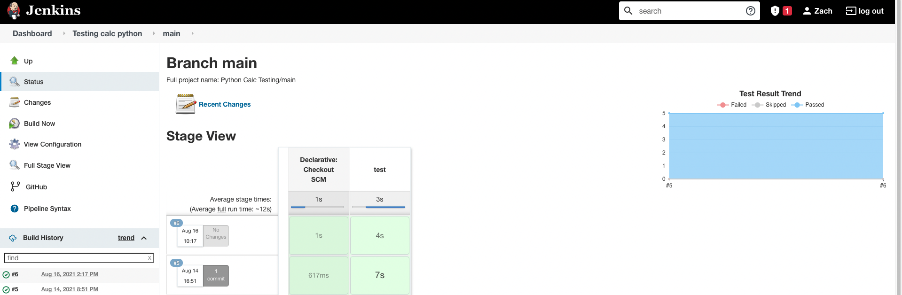

# Deployment 3 Jenkins with Pytest

## Steps

1. Created an EC2 instance hosting a Jenkins pipeline. 
    - Make sure git and jenkins is installed.
2. Create a Jenkinsfile in the root of your Github repository which Jenkins will be accessing. 
```
pipeline {
  agent any
  stages {
    stage('test') {
      steps {
        sh ''' #!/bin/bash 
        python3 -m venv test3
        source test3/bin/activate
        pip install pip --upgrade
        pip install pytest
        py.test --verbose --junit-xml test-reports/results.xml
        '''
        
      }
      post{
        always {
          junit 'test-reports/results.xml'
        }
      }
    }
  }
}
```

3. Create a new multi-branch pipeline in Jenkins hooked to the Github repo with your credentials. 
4. Click build now on your Jenkins dashboard to see your first successful build. 
   

5. Now to follow the spirit of Test Driven Development we are going to write the test cases for our new feature of multiplying by 2.
6. Create a new python file titled test_multiply2vals.py and enter the following lines
```
# test_multiply2vals.py
import pytest

def test_float_multiplication():
        """
        Test that multiplication between an integer/float and another integer/float
        will return the correct value

        """

        result = calc.multiply('3.6', '5.4')
        assert result == (3.6*5.4)

```

