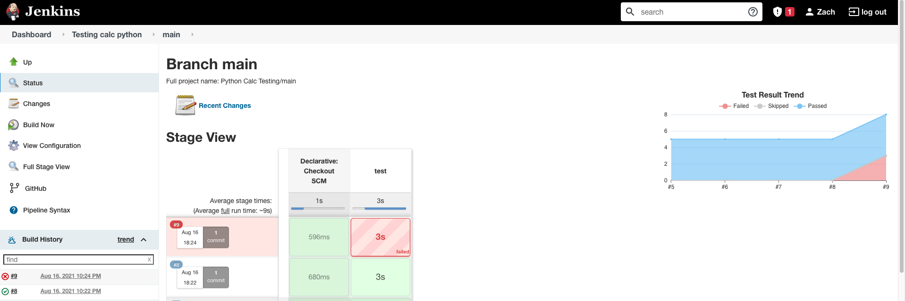
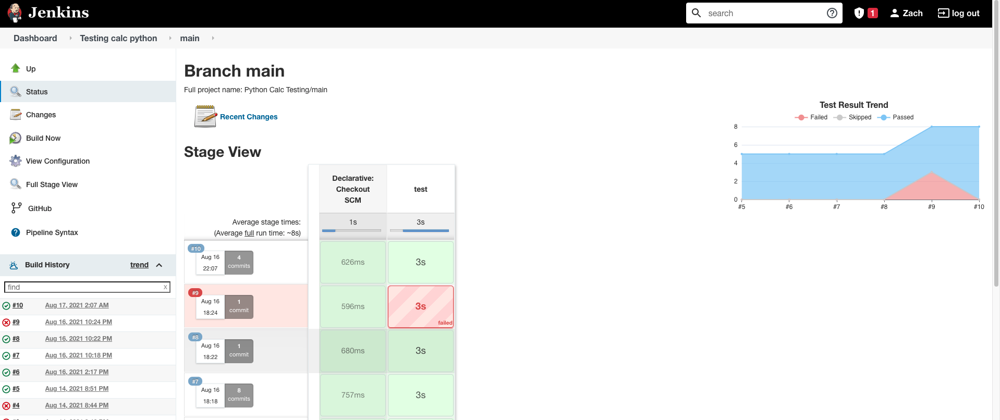

# Deployment 3 Jenkins with Pytest

## Goals:
1. Create a CI/CD pipeline with Jenkins that implements testing for a python command line application that adds two values together.
2. Following the principles of Test Driven Development create a new test for a feature that hasn't been implemented yet.
3. Create the new feature and make sure it passes the previous tests created for it.

## Steps to build:

### Building A Pipeline that can run tests

1. Create an EC2 instance to host Jenkins. 
    - Make sure git and jenkins are installed.
2. [Fork the Deployment 3 repository on Github](https://github.com/kura-labs-org/DEPLOY03_TEST)
3. Make a Jenkinsfile in the root of your Github repository which Jenkins will be accessing. 
```
pipeline {
  agent any
  stages {
    stage('test') {
      steps {
        sh ''' #!/bin/bash 
        # Creating a virtual environment called test3 to run our python application and tests.
        python3 -m venv test3
        source test3/bin/activate
        pip install pip --upgrade
        # Installing pytest for our virtual environment in order to run our tests.
        pip install pytest
        # Export pytest results in junit-xml format to the test-reports folders
        py.test --verbose --junit-xml test-reports/results.xml
        '''
        
      }
      post{
        always {
          junit 'test-reports/results.xml'
        }
      }
    }
  }
}
```

4. Create a new multi-branch pipeline in Jenkins hooked to the Github repo with your credentials. 
5. Make a Github webhook that will notify Jenkins of a new push to the repository. 
6. Click build now on your Jenkins dashboard to see your first successful build. 
   

7. Now to follow the spirit of test driven development we are going to write the test cases for our new feature of multiplying by 2.

### Multiplying By 2 Feature 
8. Create a new python file titled test_multiply2vals.py and enter the following lines
```
# test_multiply2vals.py
import pytest
import calc

def test_multiplication():
        """
        Test that multiplication between an integer/float and another integer/float
        will return the correct value.

        """

        result = calc.multiply(3,3)
        assert result == 3 * 3

def test_float_multiplication():
        """
        Test that multiplication between an integer/float and another integer/float
        will return the correct value.

        """

        result = calc.multiply('3.6', '5.4')
        assert result == (3.6*5.4)


def test_string_multiplication():
        """
        Test that a user can't multiply strings. And that it will return the correct error.
        """

        result = calc.multiply('3', 'A string')
        
        assert result == 'Error: Arguments must be an integer or float'

```
> The above script imports the calc library from sources folder and tests to see if the function returns the correct value. If not the tests will fail. And it will fail at the moment since the multiply method hasn't been implemented yet.

 

9. Now to actually pass these failing tests we have to build the features that will pass our test cases.
10. Next add a new function called multiply to the calc library. 
```
def multiply(arg1, arg2):
    # Convert arguments to ints or floats if applicable
    arg1 = conv(arg1)
    arg2 = conv(arg2)

# The following makes sure both arguments are ints or floats, if not throw an error.
if (isinstance(arg1,(int,float)) and isinstance(arg2,(int,float))):
    print(arg1,arg2)
    return arg1 * arg2
        

else:
    return 'Error: Arguments must be an integer or float'

```
11. Since the multiply function has been added to the calc library, our tests should now pass when Jenkins runs them. Remember to push the finished code to the repo on Github!
    