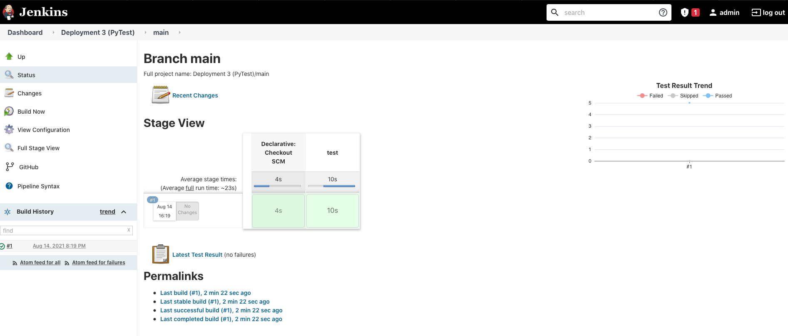
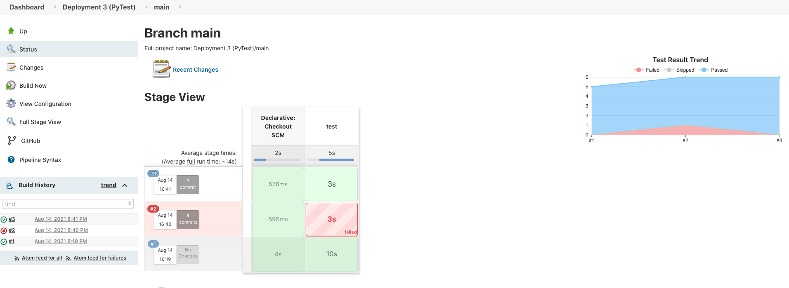

# Initializing EC2 Instance

To start, we provision an EC2 instance with the User Data
```
#!/bin/bash
sudo yum update –y
sudo wget -O /etc/yum.repos.d/jenkins.repo \
    https://pkg.jenkins.io/redhat-stable/jenkins.repo
sudo rpm --import https://pkg.jenkins.io/redhat-stable/jenkins.io.key
sudo yum upgrade
sudo yum install jenkins java-1.8.0-openjdk-devel -y
sudo systemctl daemon-reload
sudo yum install python3 -y
sudo yum install git -y
```
This script installs Jenkins, Git, and Python into the EC2 instance so that we can continue with
the exercise once the instance is booted.


After sshing into the EC2 instance, we run `sudo systemctl start jenkins` and then we use our browser to access the Jenkins UI.


# Setting up Jenkins

After logging in and downloading all of the recommended plugings, we have to create a new task.
In this case we selected Multibranch Pipeline. After linking our GitHub repository, we're able to
scan our repository. If we haven't yet added a Jenkins file in our repository, we will get an error
saying that it couldn't find a Jenkinsfile. In this case we just need to add one in the root directory
of our repository.

```
pipeline { 
    agent any 
    stages {
        stage('test') { 
            steps { 
                sh '''#! /bin/bash
                python3 -m venv test3
                source test3/bin/activate
                pip install pip --upgrade
                pip install pytest
                py.test --verbose --junit-xml test-reports/results.xml sources/test_calc.py
                '''
                }
            post {
                always {
                    junit 'test-reports/results.xml'
                }
            }
        }
    }
}
```


After we add this and rereun the build from Jenkins we can see that the test passed.




# Adding New Functionality and Test

After this, we can go into the python code in the repository and make some changes. I decided to
add a completely new function called add3() which takes three arguments and returns the sum of
the three arguments.

I had to make changes in both non test files. I then created a new test case called `tese_add_three_integers` which tested that the add3 function, when given 3 integers returned
the correct answer. I had it add the numbers 1,2,3 and at first asserted that it returned the number 1. It failed when I ran the test. I then updated the test function to assert that the numbers summed
up to 6. Afterwards, the tests passed.


